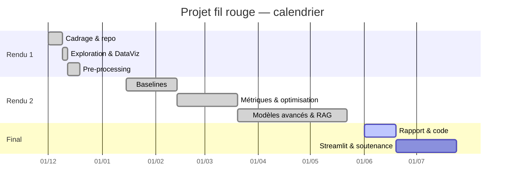

# Quiz IA — Génération et scoring d'idées de quiz vidéo virales bilingues (FR/EN)

**Rapport de projet de fin d'étude — Data Science**

Ce document consolide l'ensemble du travail : exploration et préparation des données,
modélisation, conclusions et perspectives. Il est prévu pour être mis en forme directement
(les figures citées sont dans `reports/figures/`).

---

## 1. Introduction

### 1.1 Contexte

**Métier.** Une chaîne YouTube de quiz publie environ une vidéo par jour, en français et en
anglais. La production est automatisée ; le goulot d'étranglement est désormais l'idéation
créative quotidienne : trouver des idées qui sortent du lot et ont un potentiel viral. Les
concurrents publient 1,5 à 2 vidéos par jour, l'enjeu concurrentiel est réel.

**Technique.** Le système combine deux briques : un générateur d'idées par récupération de
contexte (RAG) et un modèle de scoring viral supervisé, entraîné sur des métadonnées de
vidéos concurrentes collectées via l'API YouTube. L'ensemble est industrialisé (collecte,
pipeline reproductible, API, démonstration, tâche quotidienne).

**Économique.** Le temps d'idéation est le coût marginal principal d'un créateur solo.
L'automatiser permet de tenir un rythme bilingue soutenu et de concentrer l'effort sur les
idées à plus fort potentiel.

**Scientifique.** Le projet mobilise deux champs : la prédiction supervisée de popularité
(régression sur données tabulaires) et la génération de texte contrainte et ancrée (RAG).
Prédire la viralité *avant publication* est un problème ouvert et bruité — un cas d'étude
représentatif.

### 1.2 Objectifs

1. Collecter et structurer un corpus de vidéos concurrentes, étiqueté par famille × catégorie × langue.
2. Définir une variable cible de viralité robuste et comparable entre niches.
3. Entraîner un modèle prédisant cette viralité à partir de signaux disponibles avant publication.
4. Générer des idées ancrées (RAG) et les classer par potentiel viral prédit.
5. Exposer le tout via une API et une démonstration, avec une mise à jour quotidienne.

### 1.3 Expertise

Projet mené par un candidat unique, créateur de la chaîne concernée : forte expertise
métier (formats, niches, audience) et montée en compétence Data Science au fil de la
formation. L'expertise métier a guidé la taxonomie et l'interprétation des résultats.

---

## 2. Compréhension et manipulation des données

### 2.1 Cadre

- **Jeu de données** : métadonnées de vidéos YouTube concurrentes, via la YouTube Data API v3
  (source légale, officielle), complétées par des sujets tendance (Google Trends) et des
  mots-clés agrégés.
- **Disponibilité / propriété** : métadonnées publiques, aucune donnée personnelle.
- **Volumétrie** : 476 vidéos sur 7 catégories × 2 langues, plus 350 mots-clés et 171 sujets tendance.

### 2.2 Pertinence et variable cible

Les variables les plus pertinentes a priori : titre, durée, catégorie, famille, langue,
moment de publication.

La viralité brute (vues) n'est pas comparable d'une vidéo à l'autre. On construit donc un
score relatif :

```
views_per_day  = vues / ancienneté (jours)
virality_log   = log(1 + views_per_day)
virality_score = z-score de virality_log au sein de chaque (catégorie × langue)
```

`virality_score` mesure la performance relative à la niche et à la langue : 0 = vidéo
moyenne, positif = surperformance. C'est la cible du modèle.

**Particularités et limites.**
- Langues : EN = 290, FR = 186 → sur-représentation de l'anglais (biais de collecte).
- Durée médiane ≈ 13 min : corpus majoritairement en format long.
- Les vidéos ne sont pas pré-étiquetées : la famille est déduite par règles, avec 40,1 % de
  valeurs manquantes — limite traitée plus loin par un classifieur dédié.

### 2.3 Dictionnaire de données

Table `data/raw/competitors/videos.csv` — 476 lignes. La colonne « Dispo. a priori » indique
si la variable est connue **avant publication** (donc utilisable comme feature) ou seulement
après (issue de la performance, donc exclue pour éviter la fuite).

| Colonne | Type | Description | Dispo. a priori | Taux NA | Gestion NA |
|---|---|---|---|---|---|
| `video_id` | texte | identifiant YouTube unique | — | 0 % | clé, non nulle |
| `title` | texte | titre de la vidéo | oui | 0 % | — |
| `description` | texte | description | oui | 3,8 % | optionnelle, concaténée au titre |
| `channel_id` | texte | identifiant de la chaîne | oui | 0 % | — |
| `channel_title` | texte | nom de la chaîne | oui | 0 % | — |
| `published_at` | date | date de publication (ISO 8601) | oui | 0 % | sert au calcul d'ancienneté |
| `tags` | liste | mots-clés YouTube | oui | 0 % | liste vide si absente |
| `category_id_yt` | entier | catégorie native YouTube | oui | 0 % | non utilisée (taxonomie propre) |
| `default_language` | catégoriel | langue déclarée | oui | ~variable | complétée par détection |
| `duration_iso` | texte | durée ISO 8601 (PT#M#S) | oui | 0 % | parsée en secondes |
| `view_count` | entier | nombre de vues | **non** | 0 % | base de la cible, **exclue des features** |
| `like_count` | entier | likes | **non** | 1,7 % | exclue (fuite) |
| `comment_count` | entier | commentaires | **non** | 0 % | exclue (fuite) |
| `thumbnail` | texte | URL de la miniature | oui | 0 % | non utilisée |
| `language` | catégoriel | **axe 1** — FR / EN (détectée) | oui | 0 % | repli sur la langue de collecte |
| `category` | catégoriel | **axe 2** — chaîne exploitée (7 valeurs) | oui | 0 % | connue par la requête de collecte |
| `family` | catégoriel | **axe 3** — famille de quiz (inférée) | oui | 40,1 % | complétée par le classifieur (§5.2) |
| `family_group` | catégoriel | grande famille | oui | 40,1 % | idem |

---

## 3. Pre-processing et feature engineering

**Nettoyage.** Dédoublonnage par `video_id`, parsing des dates et des durées, détection de
langue, étiquetage sur trois axes (catégorie, langue, famille).

**Transformations.** Extraction de features de titre (longueur, mots, présence de chiffre /
emoji / question / exclamation, ratio de majuscules), durée en secondes, jour et heure de
publication, encodage one-hot des axes catégoriels.

**Anti-fuite.** La cible dérivant des vues, on exclut des features les vues, likes et
commentaires. Le modèle n'apprend que sur des signaux disponibles avant publication. Un
garde-fou échoue si une colonne interdite s'y glisse.

**Réduction de dimension.** Espace de features modeste (~30 colonnes) ; une PCA n'est pas
nécessaire et nuirait à l'interprétabilité (SHAP).

---

## 4. Visualisations et statistiques

Chaque figure est commentée et validée par un test statistique.

**Figure 1 — Distribution du score de viralité** (`figures/01_virality_distribution.png`).
Après passage au logarithme puis centrage-réduction par niche, le score est quasi symétrique
(asymétrie de Fisher = −0,34, proche de 0). **Validation** : 16,4 % des vidéos dépassent +1
écart-type — ce sont les surperformances (« hits ») que l'on cherche à imiter.

**Outliers.** Sur les vues par jour brutes, le test de l'écart interquartile (IQR) repère
60 valeurs extrêmes (12,6 %), avec une médiane à 442 vues/jour mais un maximum à ~95 660 :
dispersion très forte. C'est précisément ce qui justifie la transformation log + z-score de
la cible, qui ramène ces extrêmes à une échelle exploitable au lieu de les supprimer.

**Figure 2 — Volume par catégorie et langue** (`figures/02_volume_by_category_language.png`).
L'anglais domine (290 EN / 186 FR, soit 61 % / 39 %). **Validation** : un test binomial contre
une répartition équilibrée 50/50 donne p ≈ 2,2 × 10⁻⁶ → le déséquilibre n'est pas dû au
hasard. C'est un biais de collecte à garder en tête pour l'interprétation.

**Figure 3 — Vues par jour par catégorie** (`figures/03_views_per_day_by_category.png`).
Les niches n'ont pas la même dynamique. Test de Kruskal-Wallis : H = 79,9, p ≈ 3,7 × 10⁻¹⁵ →
différences hautement significatives, ce qui justifie la normalisation de la cible par niche.

**Figure 4 — Répartition des familles** (`figures/04_family_distribution.png`).
DEVINE domine largement (238 sur les familles reconnues), et 40,1 % des vidéos ne sont pas
classées. **Validation** : un test du χ² d'ajustement contre une répartition uniforme donne
χ² = 724,6, p ≈ 1,6 × 10⁻¹⁵⁵ → la domination de DEVINE est massivement significative. Ce
déséquilibre, et la part d'inconnues, motivent le classifieur de famille (§5.2).

**Figure 5 — Durée vs viralité** (`figures/05_duration_vs_virality.png`).
Corrélation de Spearman durée ↔ viralité : ρ = 0,336, p ≈ 4,6 × 10⁻¹⁴ → positive et
significative, mais modérée (possible confondant : les grosses chaînes font des vidéos
longues). L'indicateur binaire « Short » n'est, lui, pas discriminant (p = 0,82).

**Figure 6 — Corrélations** (`figures/06_correlation_heatmap.png`).
**Validation** : la corrélation absolue maximale entre features est de 0,90 — une seule paire
fortement liée (les deux mesures de longueur du titre, en caractères et en mots, redondantes
par nature). Toutes les autres paires restent faiblement corrélées. On peut donc, si besoin,
ne garder qu'une des deux mesures de longueur ; le reste ne présente pas de multicolinéarité
problématique, ce qui conforte le choix de ne pas réduire la dimension.

**Figure 9 — Vues par jour : FR vs EN** (`figures/09_fr_vs_en.png`).
**Test complémentaire.** Médianes de vues/jour FR = 283, EN = 815 ; Mann-Whitney
p ≈ 1,8 × 10⁻⁸ → l'anglais accumule significativement plus de vues (marché plus large et
plus concurrentiel). Le boxplot (échelle log) confirme visuellement le décalage des
distributions entre les deux langues.

**Conclusion de l'exploration.** Cible à normaliser par niche (validé), durée prédicteur
candidat fort mais à surveiller, biais de langue et familles manquantes comme limites
principales. On passe à une régression prédisant `virality_score`.

---

## 5. Modélisation

### 5.1 Scoring viral (régression)

**Problème.** Régression : prédire `virality_score` (continu). Tâche proche du *ranking* — on
veut surtout bien ordonner les idées.

**Métrique principale : corrélation de Spearman** (on mesure la qualité du classement),
complétée par MAE et RMSE. Objectif fixé (H2) : Spearman > 0,5.

**Démarche** (train/test 80/20, validation croisée 5-fold) :

| Modèle | Spearman | MAE | RMSE |
|---|---|---|---|
| Baseline — DummyRegressor (moyenne) | 0,000 | 0,866 | 1,025 |
| Régression linéaire | 0,361 | 0,798 | 0,951 |
| **LightGBM (retenu)** | **0,476** | 0,737 | 0,926 |
| LightGBM optimisé (GridSearch) | 0,428 | 0,765 | 0,932 |

LightGBM bat nettement les baselines. Fait notable : l'optimisation par GridSearch ne fait
pas mieux que le modèle par défaut sur ce petit volume (variance élevée), phénomène assumé
et documenté.

**Choix des familles de modèles — à assumer.** On a privilégié le **boosting** (LightGBM),
état de l'art sur données tabulaires de cette taille. Le **bagging** (Random Forest) a été
écarté car il apporte peu ici face au boosting et alourdit sans gain attendu sur 476 lignes.
Le **Deep Learning** n'a pas été entraîné *sur le scoring* : un réseau serait sur-dimensionné
pour 476 exemples et ~30 features. Le volet neuronal / NLP du projet est porté par le
**générateur RAG** (représentation vectorielle des textes + modèle de langage). C'est un
choix méthodologique conscient, adapté au volume de données, et non une lacune.

### 5.2 Classifieur de famille (classification)

Pour combler les 40 % de familles manquantes, on traite le problème comme une classification
multiclasses (titre → famille). Métrique adaptée au déséquilibre : macro-F1.

| Modèle | Accuracy | Macro-F1 |
|---|---|---|
| Baseline (classe majoritaire) | 0,84 | 0,30 |
| Régression logistique (équilibrée) | 0,76 | 0,53 |
| **LightGBM (équilibré)** | **0,90** | **0,76** |

Validation croisée macro-F1 : 0,69 ± 0,17. Le contraste baseline (0,84 d'accuracy mais 0,30
de macro-F1) illustre l'importance du choix de métrique. Le modèle a comblé les 191 familles
manquantes.

**Figure 8 — Matrice de confusion du classifieur de famille** (`figures/08_family_confusion.png`).
Les familles principales sont bien séparées ; les confusions résiduelles concernent surtout
les classes minoritaires, peu représentées dans les données.

### 5.3 Génération d'idées (RAG, sans fine-tuning)

Architecture 100 % RAG : pour une niche donnée, on récupère les titres qui marchent, les
tendances et les mots-clés, on les fournit en contexte à un LLM (via API), qui produit des
idées. Chaque idée est notée par le modèle de scoring puis classée.

```
contexte récupéré → prompt LLM → idées → scoring → classement
```

Le retrieval utilise TF-IDF (corpus petit et spécialisé, hors-ligne, gratuit). Le pipeline
est validé de bout en bout et la génération réelle fonctionne.

### 5.4 Interprétation des résultats

**Figure 7 — Importance des variables (SHAP) du scoring** (`figures/07_shap_summary.png`).
Contribution moyenne de chaque variable à la prédiction de viralité — top features :

| Feature | Importance |
|---|---|
| `duration_seconds` | 0,320 |
| `title_exclam` | 0,093 |
| `tag_count` | 0,091 |
| `title_len_chars` | 0,089 |
| `publish_hour` | 0,089 |

La durée domine, cohérent avec l'exploration. À nuancer : possible confondant (durée ≈ type
de chaîne). Les autres leviers (ponctuation, longueur du titre, heure de publication) sont
actionnables par le créateur. Les erreurs les plus fortes concernent les vidéos atypiques de
leur niche.

---

## 6. Conclusions

Le projet aboutit à un système complet : collecte étiquetée → features anti-fuite → scoring
viral → classifieur de famille → génération RAG → API + démonstration → tâche quotidienne.

| Hypothèse | Verdict |
|---|---|
| H1 — RAG > zero-shot (style + justesse) | En cours (pipeline validé, évaluation à formaliser) |
| H2 — Scoring Spearman > 0,5 | Non atteinte, proche (0,476) ; baselines nettement battues |
| H3 — Qualité ∝ pertinence du retrieval | À évaluer |

Conclusion nuancée et honnête : l'approche est pertinente (les modèles battent nettement les
baselines, l'architecture tient et se boucle seule), mais la performance prédictive reste à
consolider — attendu sur un premier corpus de 476 vidéos.

---

## 7. Difficultés et verrou scientifique

**Verrou principal.** Prédire la viralité avant publication, à partir de signaux de surface,
sur un petit corpus bruité et avec des confondants (durée). Problème intrinsèquement
difficile et partiellement irréductible.

- **Prévisionnel** : abandon du fine-tuning QLoRA au profit du RAG (temps, GPU, reproductibilité).
- **Données** : vidéos non étiquetées (familles manquantes), biais de langue.
- **Pertinence** : confondant sur la durée ; petit volume → variance (GridSearch non concluant).
- **IT** : contrainte « infra gratuite » → TF-IDF et tout en CPU.

---

## 8. Bilan

**Contribution.** Une chaîne complète et reproductible reliant une problématique métier à une
solution opérationnelle, avec deux modèles supervisés construits et entraînés (régression +
classification) et une couche de génération.

**Résultats vs benchmark** (baselines internes) :

| Référence | Spearman |
|---|---|
| Trivial (Dummy) | 0,00 |
| Baseline raisonnable (linéaire) | 0,36 |
| Notre modèle (LightGBM) | 0,48 |

Gain net et mesurable. La littérature sur la prédiction de popularité avant publication
rapporte des corrélations modérées, ce qui situe ce résultat dans un ordre de grandeur crédible.

**Insertion métier.** L'API expose un menu du jour (5 FR + 5 EN classées), consommable par
l'application de production : l'idéation devient un service automatisé.

---

## 9. Suite du projet et ouverture

- Enrichir les features avec les signaux de tendances / mots-clés déjà collectés.
- Augmenter le volume de collecte pour réduire la variance.
- Embeddings sémantiques de titres en complément des features de surface.
- Comparer CatBoost / XGBoost et l'ensembling.
- Mesurer a posteriori la corrélation entre score prédit et performance réelle des idées
  publiées — validation en conditions réelles.

---

## 10. Bibliographie

- DataScientest — Supports de formation (Machine Learning, NLP, MLOps).
- Robert, S. — *Blog technique : Machine Learning, MLOps et déploiement* (en français). <https://blog.stephane-robert.info/>
- Documentation officielle *Scikit-learn* — modèles, métriques, prétraitement. <https://scikit-learn.org/>
- Documentation officielle *LightGBM* — gradient boosting. <https://lightgbm.readthedocs.io/>
- Documentation officielle *SHAP* — interprétabilité des modèles. <https://shap.readthedocs.io/>
- Documentation officielle *FastAPI* (disponible en français). <https://fastapi.tiangolo.com/fr/>
- Documentation officielle *Streamlit* — applications de données. <https://docs.streamlit.io/>
- Google — *API YouTube Data v3*, documentation développeurs (disponible en français). <https://developers.google.com/youtube/v3?hl=fr>

---

## 11. Annexes

### Diagramme de Gantt



### Description des fichiers de code

| Module | Contenu |
|---|---|
| `src/ingestion/` | collecte YouTube + Trends, étiquetage, mots-clés |
| `src/features/` | variable cible, features anti-fuite, exploration |
| `src/scoring/` | baselines, LightGBM, optimisation, SHAP |
| `src/family/` | classifieur de famille |
| `src/generator/` | corpus RAG, retriever, génération, scoring des idées |
| `src/api/` | API FastAPI |
| `src/mlops/` | tâche quotidienne, suivi de dérive |
| `streamlit_app/`, `web/` | démonstration et interface de test |

### Technologies et environnement

- **Langage** : Python 3.12
- **Analyse de données** : pandas, numpy, scipy
- **Modélisation** : scikit-learn, LightGBM ; interprétabilité : SHAP
- **NLP / génération** : TF-IDF (scikit-learn), modèle de langage via API (RAG)
- **Collecte** : YouTube Data API v3, Google Trends (pytrends)
- **Application** : FastAPI (API) et Streamlit (démonstration)
- **Industrialisation** : Docker / Docker Compose et GitHub Actions (collecte quotidienne
  automatisée et déploiement continu)

L'ensemble tient sur une infrastructure gratuite et tourne en CPU (aucun entraînement sur GPU).
