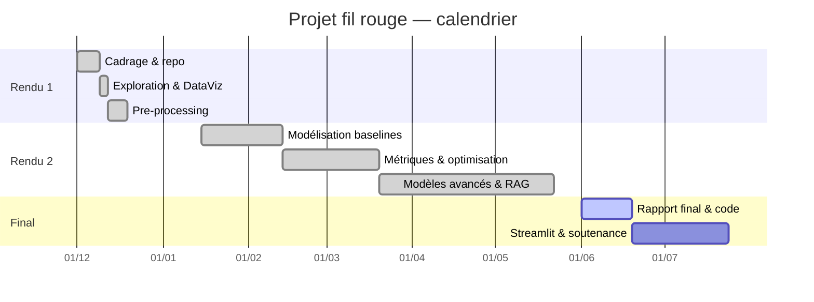

# Rapport final

**Projet fil rouge DataScientest** — Système IA de génération et de scoring d'idées de quiz vidéo virales bilingues (FR/EN)

---

## Sommaire

1. [Rendu 1 — Exploration, DataViz & pre-processing](rendu_1.md)
2. [Rendu 2 — Modélisation](rendu_2.md)
3. Conclusions tirées *(ci-dessous)*
4. Difficultés & verrou scientifique
5. Bilan
6. Suite du projet & ouverture
7. Bibliographie
8. Annexes (Gantt, description des fichiers de code)

> Ce rapport final consolide les deux premiers rendus (liés ci-dessus) et ajoute conclusions, bilan et ouverture. Les détails méthodologiques et statistiques figurent dans les rendus.

---

## 3. Conclusions tirées

Le projet aboutit à un **système complet et fonctionnel de bout en bout** : collecte étiquetée → features anti-fuite → scoring viral (LightGBM) → génération d'idées (RAG) → API + démo Streamlit → boucle quotidienne automatisée avec monitoring.

**Retour sur les hypothèses de recherche :**

| Hypothèse | Verdict | Détail |
|---|---|---|
| **H1** — RAG > zero-shot (style + justesse) | ⏳ *En cours* | Pipeline validé ; évaluation quantitative dès le branchement de l'API LLM |
| **H2** — Scoring : Spearman > 0,5 | ❌ *Non validée (proche)* | Spearman test = **0,476** ; baselines nettement battues, mais seuil non atteint |
| **H3** — Qualité ∝ pertinence du retrieval | ⏳ *À évaluer* | Retrieval TF-IDF fonctionnel ; protocole d'évaluation à finaliser |

La conclusion principale est **nuancée et honnête** : l'approche est **pertinente** (le modèle bat très nettement les baselines, l'architecture tient debout et se boucle seule), mais la **performance prédictive reste à consolider** — ce qui est attendu sur un premier corpus de 476 vidéos, bruité et biaisé.

---

## 4. Difficultés rencontrées

**Verrou scientifique principal.** Prédire la viralité d'une vidéo **avant publication**, à partir de **signaux de surface** (titre, durée, format), sur un **petit corpus bruité** et en présence de **confondants** (la durée corrèle avec la viralité, mais reflète peut-être surtout le type de chaîne). C'est un problème intrinsèquement difficile et partiellement irréductible.

| Axe | Difficulté rencontrée |
|---|---|
| **Prévisionnel** | Le fine-tuning QLoRA initialement prévu a été **abandonné au profit du RAG** (temps, GPU, reproductibilité) — décision structurante prise en cours de route. |
| **Jeux de données** | Vidéos concurrentes **non étiquetées** → 40,1 % de familles manquantes ; **biais de langue** (EN 61 %). |
| **Compétences** | Montée en compétence sur SHAP, RAG et l'industrialisation (API/CI). |
| **Pertinence** | Risque de confondant sur la durée ; petit volume → variance élevée (GridSearch non concluant). |
| **IT** | Contrainte « infra gratuite » → choix de TF-IDF (pas de GPU), tout en CPU. |

---

## 5. Bilan

**Contribution principale.** Concevoir, de zéro, une **chaîne MLOps complète et reproductible** reliant une problématique métier (idéation quotidienne) à une solution IA opérationnelle (menu du jour scoré), avec une taxonomie métier fidèle (familles × catégories × langues).

**Résultats vs benchmark.** Faute de benchmark public sur cette tâche précise, les **baselines internes** servent de référence :

| Référence | Spearman |
|---|---|
| Aléatoire / trivial (Dummy) | 0,00 |
| Baseline raisonnable (linéaire) | 0,36 |
| **Notre modèle (LightGBM)** | **0,48** |

Le modèle apporte donc un **gain net et mesurable** sur les références. La littérature sur la prédiction de popularité *avant publication* rapporte elle-même des corrélations modérées, ce qui **situe notre résultat dans un ordre de grandeur crédible**.

**Objectifs — atteints ou non :**

| Objectif | Statut | Process métier associé |
|---|---|---|
| Corpus étiqueté (famille × catégorie × langue) | ✅ Atteint | alimente scoring + RAG |
| Variable cible de viralité | ✅ Atteint | cible du modèle |
| Modèle prédictif | 🟡 Partiel (0,48 < 0,5) | scoring des idées |
| Génération RAG + classement | ✅ Pipeline (éval en cours) | menu du jour |
| API + démo + boucle quotidienne | ✅ Atteint | intégration produit |

**Insertion métier.** Le système s'intègre directement dans le flux de production : l'API expose un **menu du jour** (5 FR + 5 EN classées), consommable par l'application de génération de vidéos — l'idéation devient un **service automatisé**.

---

## 6. Suite du projet & ouverture

**Pistes d'amélioration du modèle :**
1. **Enrichir les features** avec les signaux de tendances / mots-clés déjà collectés.
2. **Augmenter le volume** de collecte (plus de vidéos par niche) pour réduire la variance.
3. **Embeddings sémantiques de titres** (sentence-transformers) en remplacement/complément des features de surface.
4. **Sous-modèle de classification de famille** pour combler les 40 % de NA.
5. Tester **CatBoost/XGBoost** et l'**ensembling**.

**Ouverture scientifique.** Le projet illustre qu'un **système hybride « génératif (RAG) + prédictif (boosting) »** est réalisable sous fortes contraintes (solo, gratuit), et documente les limites de la prédiction de viralité de surface. Une piste de recherche : mesurer *a posteriori* la corrélation entre le **score prédit** et la **performance réelle** des idées effectivement publiées — bouclant ainsi la validation en conditions réelles.

---

## 7. Bibliographie

- Google, *YouTube Data API v3 — Reference*, developers.google.com/youtube/v3.
- Ke, G. *et al.* (2017). *LightGBM: A Highly Efficient Gradient Boosting Decision Tree*. NeurIPS.
- Lundberg, S. & Lee, S.-I. (2017). *A Unified Approach to Interpreting Model Predictions (SHAP)*. NeurIPS.
- Lewis, P. *et al.* (2020). *Retrieval-Augmented Generation for Knowledge-Intensive NLP Tasks*. NeurIPS.
- Pedregosa, F. *et al.* (2011). *Scikit-learn: Machine Learning in Python*. JMLR.
- Spearman, C. (1904). *The proof and measurement of association between two things*.
- Documentation Streamlit, FastAPI, et pytrends (bibliothèques utilisées).

---

## 8. Annexes

### 8.1 Diagramme de Gantt

### 8.2 Description des fichiers de code

| Module | Contenu |
|---|---|
| `src/taxonomy.py` | taxonomie de référence (familles, 7 catégories-chaînes, langues) |
| `src/ingestion/` | collecte YouTube + Trends, étiquetage 3 axes, mots-clés, auto-découverte de chaînes |
| `src/features/` | définition de la cible (viralité), feature engineering anti-fuite, EDA/figures |
| `src/scoring/` | baselines, LightGBM, GridSearchCV, métriques (Spearman), SHAP |
| `src/generator/` | corpus RAG, retriever TF-IDF, client LLM API, scoring des idées, génération |
| `src/api/` | API FastAPI (`/health`, `/generate`, `/score`, `/suggestions/today`) |
| `src/mlops/` | boucle quotidienne, monitoring de dérive |
| `streamlit_app/` | démo PoC multi-onglets |
| `.github/workflows/daily.yml` | planificateur cron (menu du jour) |

Chaque sprint est documenté par un `README.md` dédié dans son module.

---

*Dépôt : le code propre, commenté et versionné accompagne ce rapport. Voir le `README.md` racine pour l'architecture, les roadmaps et les instructions d'exécution.*
