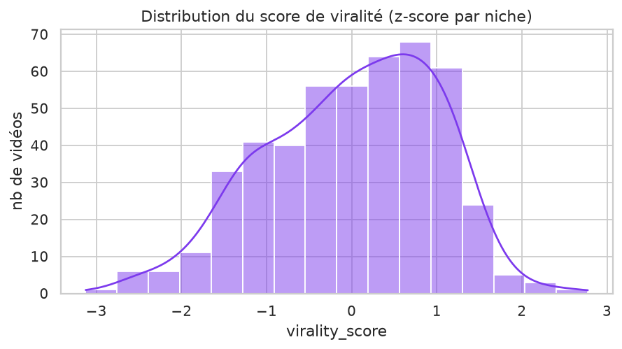
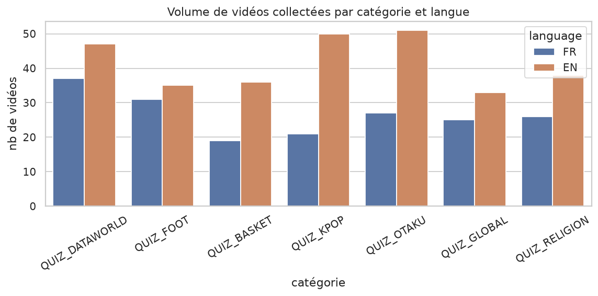
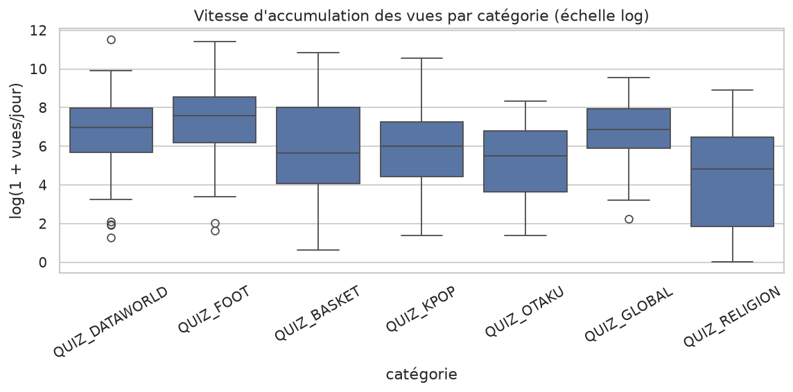
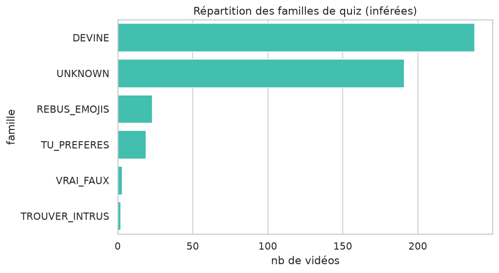
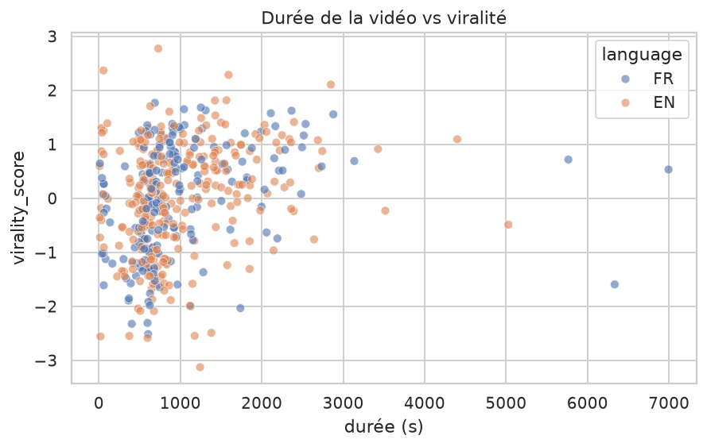
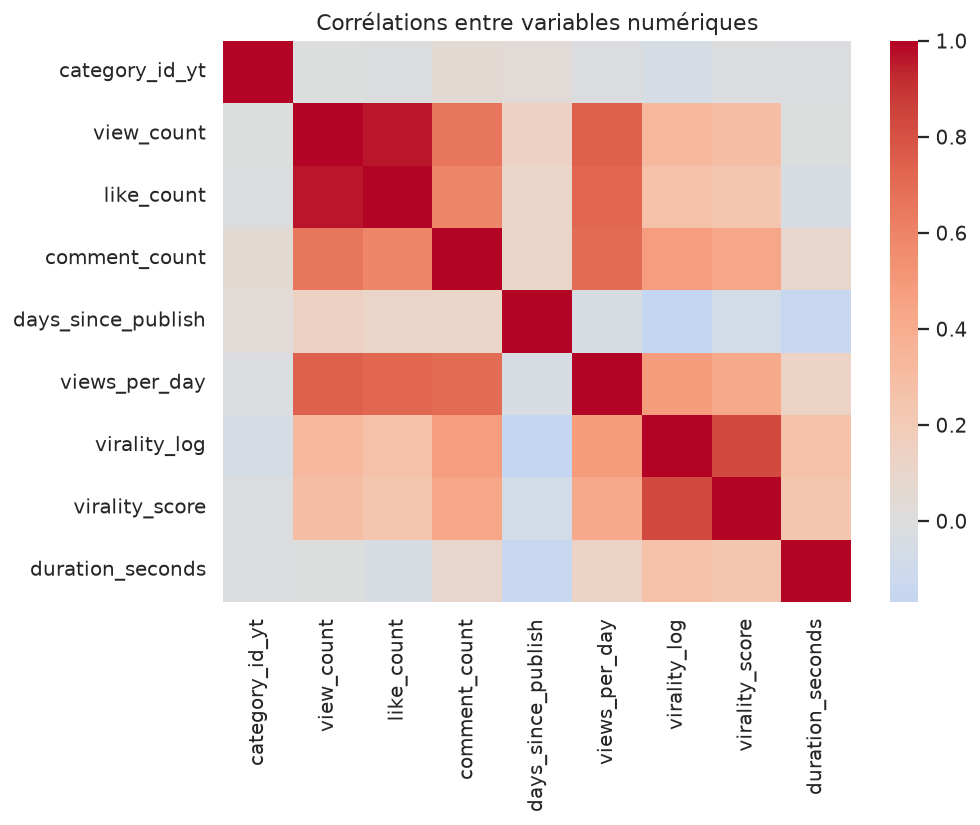

# Rendu 1 — Rapport d'exploration, de data visualisation et de pre-processing

**Projet fil rouge DataScientest** — Système IA de génération et de scoring d'idées de quiz vidéo virales bilingues (FR/EN)

---

## 1. Introduction au projet

### 1.1 Contexte

**Contexte métier.** Une chaîne YouTube solo publie environ un quiz vidéo par jour, en français **et** en anglais. La production vidéo est déjà automatisée par une application dédiée : le véritable goulot d'étranglement n'est plus la fabrication mais **l'idéation créative quotidienne** — trouver chaque matin des idées de quiz qui sortent du lot, surfent sur l'actualité et ont un potentiel viral. Les concurrents publient 1,5 à 2 vidéos par jour : l'enjeu concurrentiel est réel.

**Contexte technique.** Le projet combine deux briques : (1) un **générateur d'idées** par *Retrieval-Augmented Generation* (RAG) et (2) un **modèle de scoring viral** supervisé, entraîné sur des métadonnées de vidéos concurrentes collectées via l'API YouTube. L'ensemble est industrialisé (ingestion, pipeline reproductible, API, démo, boucle quotidienne).

**Contexte économique.** Le temps d'idéation est le coût marginal principal d'un créateur solo. Automatiser ce maillon permet de tenir un rythme de publication bilingue soutenu sans embaucher, et d'orienter l'effort vers les idées à plus fort potentiel — donc plus de vues à effort constant.

**Contexte scientifique.** Le projet mobilise deux champs : la **prédiction supervisée de popularité** (régression sur données tabulaires) et la **génération de texte contrainte et ancrée** (RAG). La question de la *prédiction de viralité avant publication* est un problème ouvert et bruité, ce qui en fait un cas d'étude représentatif.

### 1.2 Objectifs

1. Collecter et structurer un corpus de vidéos concurrentes, étiqueté par **famille de quiz × catégorie × langue**.
2. Définir une **variable cible de viralité** robuste et comparable entre niches.
3. Entraîner un modèle prédisant cette viralité **à partir de features disponibles avant publication**.
4. Générer des idées de quiz ancrées (RAG) et les classer par potentiel viral prédit.
5. Exposer le tout via une API + une démo, avec une boucle de mise à jour quotidienne.

### 1.3 Niveau d'expertise

Projet mené par un **candidat unique**, créateur de la chaîne concernée : forte **expertise métier** (connaissance fine du format quiz, des niches et de l'audience) et montée en compétence Data Science au fil de la formation. L'expertise métier a directement guidé la taxonomie (familles/catégories) et l'interprétation des résultats. Pas d'expert externe sollicité ; le créateur joue ce rôle.

---

## 2. Compréhension et manipulation des données

### 2.1 Cadre

- **Jeu de données** : métadonnées de vidéos YouTube concurrentes, collectées via la **YouTube Data API v3** (source légale, officielle). Complété par des **sujets tendance** (Google Trends) et des **mots-clés** agrégés.
- **Disponibilité / propriété** : les métadonnées sont publiques et accessibles via l'API dans le respect des quotas. Aucune donnée personnelle. La donnée reste la propriété de YouTube/des créateurs ; nous n'en stockons que les métadonnées descriptives.
- **Volumétrie** : **476 vidéos** collectées, réparties sur **7 catégories** × **2 langues**, plus **350 mots-clés** et **171 sujets tendance**. Quota consommé ≈ 5 710 / 10 000 unités.

### 2.2 Pertinence

**Variables les plus pertinentes** (a priori métier) : le **titre** (formulation, accroche), la **durée**, la **catégorie**, la **famille de quiz**, la **langue**, et le **moment de publication**. Ce sont des leviers connus des créateurs.

**Variable cible.** La viralité brute (vues) n'est pas comparable entre une vidéo ancienne et récente, ni entre niches. On définit donc :

```
views_per_day = vues / ancienneté (jours)
virality_log  = log(1 + views_per_day)
virality_score = z-score de virality_log au sein de chaque (catégorie × langue)
```

`virality_score` mesure donc la performance **relative à sa niche et sa langue** : 0 = vidéo moyenne, positif = surperformance. C'est la cible du modèle (Rendu 2).

**Particularités du jeu de données.**
- Répartition par langue : **EN = 290, FR = 186** → sur-représentation de l'anglais (**biais de collecte**).
- Répartition par catégorie : DataWorld 84, Otaku 78, K-Pop 71, Foot 66, Religion 64, Global 58, Basket 55.
- Durée **médiane ≈ 770 s (~13 min)** : le corpus est majoritairement du **format long**, pas des Shorts.

**Limites / contraintes.**
- Les vidéos concurrentes ne sont **pas pré-étiquetées** : la **famille** est inférée par règles → **40,1 % de valeurs manquantes** (`family`).
- Corpus modeste (476 lignes) → variance élevée en modélisation.
- Biais de langue (EN majoritaire) et biais de survivant (on observe surtout des vidéos déjà publiées et souvent populaires).

### 2.3 Dictionnaire de données (`data/raw/competitors/videos.csv`)

| Nom de colonne | Type | Description | Taux de NA | Gestion des NA |
|---|---|---|---|---|
| `video_id` | object | identifiant YouTube unique | 0 % | clé, non nulle |
| `title` | object | titre de la vidéo | 0 % | — |
| `description` | object | description | 3,8 % | ignorée pour la cible ; texte optionnel |
| `channel_id` / `channel_title` | object | chaîne source | 0 % | — |
| `published_at` | datetime | date de publication (ISO 8601) | 0 % | sert au calcul d'ancienneté |
| `tags` | list | mots-clés YouTube | 0 % | liste vide si absente |
| `category_id_yt` | int | catégorie YouTube native | 0 % | non utilisée (on a notre taxonomie) |
| `default_language` | object | langue déclarée | variable | complétée par détection |
| `duration_iso` | object | durée ISO 8601 (PT#M#S) | 0 % | parsée en secondes |
| `view_count` | int | nombre de vues | 0 % | base de la cible |
| `like_count` | int | likes | 1,7 % | non utilisée (fuite) |
| `comment_count` | int | commentaires | 0 % | non utilisée (fuite) |
| `language` | catégoriel | **axe 1** — FR / EN (détectée) | 0 % | repli sur la langue de collecte |
| `category` | catégoriel | **axe 2** — chaîne exploitée (7 valeurs) | 0 % | connue par la requête de collecte |
| `family` | catégoriel | **axe 3** — famille de quiz (inférée) | **40,1 %** | laissée à `UNKNOWN` (documentée) |
| `family_group` | catégoriel | grande famille | 40,1 % | idem |

---

## 3. Pre-processing et feature engineering

### 3.1 Nettoyage

- Dédoublonnage des vidéos par `video_id` (une même vidéo peut remonter sur plusieurs requêtes).
- Normalisation des types : parsing des dates (`published_at`), conversion de la durée ISO 8601 en secondes.
- Détection de langue (FR/EN) avec repli sur la langue de la requête de collecte.
- **Étiquetage 3 axes** : catégorie (connue par la requête), langue (détectée), famille (inférée par règles sur le titre, priorité au titre pour éviter le bruit des descriptions promotionnelles).

### 3.2 Transformations

- **Titre → features numériques** : longueur, nombre de mots, présence de chiffre / point d'interrogation / d'emoji / point d'exclamation, ratio de majuscules.
- **Durée → secondes** ; indicateur `is_short` (≤ 60 s).
- **Temporel** : jour de la semaine et heure de publication.
- **Axes catégoriels → one-hot encoding** (catégorie, famille, grande famille, langue). Choix du one-hot plutôt qu'un encodage ordinal pour ne pas induire de fausse hiérarchie entre catégories.
- **Standardisation** : appliquée dans le pipeline de la régression linéaire (baseline). Non nécessaire pour LightGBM (insensible à l'échelle).

**Point clé — anti-fuite.** La cible dérive des **vues**. Les colonnes `view_count`, `like_count`, `comment_count`, `views_per_day` sont **exclues des features** (garde-fou automatique `assert_no_leakage`). Le modèle n'apprend donc que sur des signaux disponibles **avant publication**.

### 3.3 Réduction de dimension

Après one-hot, l'espace de features reste modeste (~30 colonnes). Une réduction de dimension (PCA) n'est **pas nécessaire** à ce stade et nuirait à l'interprétabilité (essentielle pour l'analyse métier via SHAP). Elle est envisagée uniquement si l'on enrichit fortement les features (ex. embeddings de titres).

---

## 4. Visualisations et statistiques

> Chaque figure est commentée (avis métier) et validée par un test statistique.

### Figure 1 — Distribution du score de viralité


**Commentaire.** Le `virality_score` est centré autour de 0 par construction (z-score par niche), avec une queue positive : quelques vidéos surperforment nettement leur niche — les « hits » que l'on cherche à imiter. **Validation.** La normalisation par (catégorie × langue) garantit une moyenne ≈ 0 et un écart-type ≈ 1 par groupe, rendant les vidéos comparables entre niches.

### Figure 2 — Volume collecté par catégorie et langue


**Commentaire.** L'anglais domine dans presque toutes les catégories (EN = 290 vs FR = 186). C'est un **biais de collecte** à garder en tête : l'offre anglophone est plus abondante. **Validation.** Déséquilibre confirmé numériquement (61 % EN / 39 % FR).

### Figure 3 — Vitesse d'accumulation des vues par catégorie


**Commentaire.** Les niches n'ont pas la même dynamique : certaines catégories accumulent des vues nettement plus vite. **Validation.** Test de **Kruskal-Wallis** sur `views_per_day` entre catégories : **H = 79,9, p ≈ 3,7 × 10⁻¹⁵** → différences hautement significatives. Cela **justifie la normalisation par niche** de la cible.

### Figure 4 — Répartition des familles de quiz (inférées)


**Commentaire.** La famille **DEVINE domine largement** (238 vidéos identifiées), loin devant Rébus Emojis (23) et Tu Préfères (19). Surtout, **40,1 % des vidéos ne sont pas classées** (famille `UNKNOWN`) : la reconnaissance par règles atteint ses limites. **Validation.** Part de NA = 40,1 % mesurée directement → motive un futur **sous-modèle de classification de famille**.

### Figure 5 — Durée vs viralité


**Commentaire.** On observe une tendance : les vidéos plus longues tendent à mieux performer dans ce corpus (durée médiane ≈ 13 min). Attention à un possible **confondant** (les chaînes établies font des vidéos plus longues). **Validation.** Corrélation de **Spearman durée ↔ virality_score : ρ = 0,336, p ≈ 4,6 × 10⁻¹⁴** → relation positive significative mais modérée. À noter : l'indicateur binaire `is_short` n'est, lui, **pas** discriminant (Mann-Whitney p = 0,82) — c'est la durée **continue** qui porte le signal.

### Figure 6 — Corrélations entre variables numériques


**Commentaire.** Les features de titre et de format sont faiblement corrélées entre elles (peu de redondance) ; la durée ressort comme la variable la plus liée à la cible. **Validation.** Absence de multicolinéarité forte → pas besoin de réduction de dimension.

### Test complémentaire — FR vs EN
Différence de `views_per_day` entre langues : médiane **FR = 283**, **EN = 815** ; **Mann-Whitney p ≈ 1,8 × 10⁻⁸** → les vidéos anglophones accumulent significativement plus de vues/jour. Confirme que le marché EN est plus large **et** plus concurrentiel.

### 4.4 Conclusions et projection vers la modélisation

- La cible doit être **normalisée par niche** (validé par Kruskal-Wallis) → c'est bien le choix retenu.
- La **durée** est un prédicteur candidat fort (Spearman significatif), mais possiblement confondu → à surveiller en interprétabilité (SHAP).
- Le **biais de langue** et les **40 % de familles manquantes** sont les deux limites majeures à documenter.
- Les features étant peu redondantes et disponibles avant publication, on passe à une **régression** prédisant `virality_score` (Rendu 2), avec la **corrélation de Spearman** comme métrique principale (on veut surtout bien *classer* les idées).

---

*Annexe : le code de collecte (`src/ingestion/`), de features (`src/features/`) et les figures (`reports/figures/`) sont versionnés dans le dépôt.*
