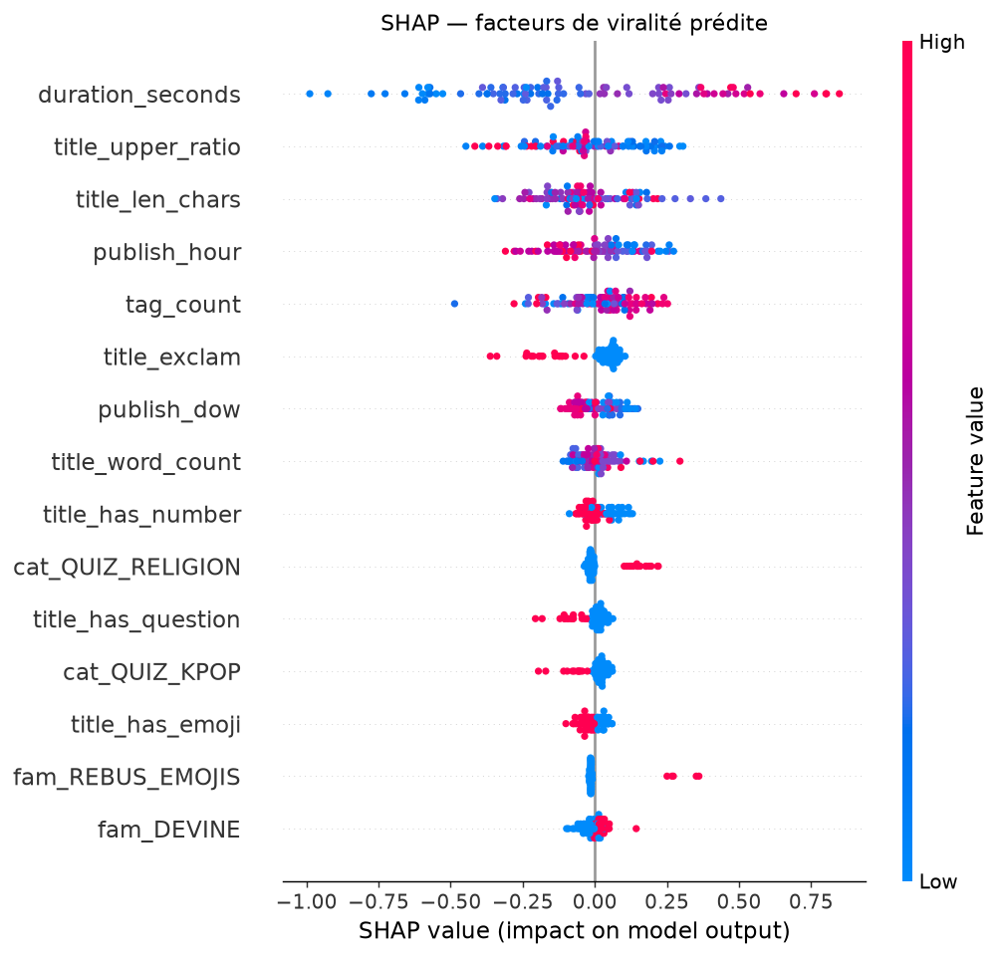

# Rendu 2 — Rapport de modélisation

**Projet fil rouge DataScientest** — Scoring viral supervisé + génération d'idées par RAG

---

## 1. Classification du problème

- **Type de problème** : **régression** — on prédit une variable cible **continue**, le `virality_score` (z-score de viralité par niche, défini au Rendu 1).
- **Tâche de Machine Learning** : **prédiction de popularité / scoring** de contenu **avant publication**, proche des tâches de *ranking* (on cherche surtout à bien ordonner les idées par potentiel).
- **Second volet (NLP / génération)** : **génération conditionnée et ancrée** d'idées de quiz par **RAG** (récupération de contexte + LLM), sans fine-tuning.

## 2. Métriques de performance

- **Métrique principale : corrélation de Spearman** (rang). Justification : l'usage final est de **classer** des idées par potentiel viral ; ce qui compte est l'**ordre**, pas la valeur exacte du z-score. Spearman mesure exactement cette qualité de classement et est robuste aux valeurs extrêmes.
- **Métriques secondaires** : **MAE** et **RMSE** (erreur sur la valeur du z-score), pour contrôler l'ampleur des erreurs.
- **Hypothèse de succès (H2)** : Spearman > 0,5 sur le jeu de test.

## 3. Choix du modèle et optimisation

### 3.1 Démarche (du simple au complexe)

Protocole : split **train/test 80/20** (380 / 96 vidéos), validation croisée **5-fold** pour l'optimisation.

| Modèle | Spearman ↑ | MAE ↓ | RMSE ↓ |
|---|---|---|---|
| Baseline triviale — DummyRegressor (moyenne) | 0,000 | 0,866 | 1,025 |
| Baseline simple — Régression linéaire (+ standardisation) | 0,361 | 0,798 | 0,951 |
| **LightGBM (paramètres par défaut)** ✅ retenu | **0,476** | **0,737** | **0,926** |
| LightGBM optimisé (GridSearchCV) | 0,428 | 0,765 | 0,932 |

### 3.2 Algorithmes essayés et modèle retenu

- **DummyRegressor** : plancher de référence. Spearman = 0 (prédiction constante) → confirme que toute performance vient du signal appris.
- **Régression linéaire** : capte une partie du signal (Spearman 0,36) mais reste limitée (relations non linéaires, interactions).
- **LightGBM (boosting de gradient)** : **modèle retenu**. Il capture les non-linéarités et interactions, gère nativement les valeurs manquantes, et reste rapide sur petit volume. Il **bat nettement les baselines** (0,476 vs 0,36 vs 0).

### 3.3 Optimisation

- **GridSearchCV** (5-fold, scorer = Spearman) sur `n_estimators`, `learning_rate`, `num_leaves`, `min_child_samples`.
- **Résultat contre-intuitif** : le modèle « optimisé » (0,428) fait **moins bien** que le modèle par défaut (0,476) sur le test. Explication : sur un **petit jeu (476 lignes)**, la validation croisée sélectionne des paramètres conservateurs qui ne généralisent pas mieux sur ce split précis — la **variance domine**. Décision : **déployer le meilleur modèle sur le test** (LightGBM défaut), et documenter honnêtement ce phénomène.
- **Modèles avancés** : le **boosting (LightGBM)** est notre modèle avancé principal. Le volet **Deep Learning / NLP** est porté par le **générateur RAG** (embeddings + LLM), pas par le scoring tabulaire (où le boosting est l'état de l'art).

### 3.4 Volet génération — RAG (sans fine-tuning)

Architecture retenue : **100 % RAG**, pas de fine-tuning (choix motivé par le volume de corpus, l'absence de GPU et la reproductibilité).

```
contexte récupéré (titres à succès + tendances + mots-clés)  →  prompt LLM  →  idées JSON  →  scoring (LightGBM)  →  classement
```

- **Retrieval** : TF-IDF filtré par (catégorie × langue) — pertinent sur un corpus petit et spécialisé, sans dépendance lourde.
- **Génération** : LLM via API (Mistral / OpenAI / Anthropic), en *prompting* avec le contexte récupéré.
- **Bouclage** : chaque idée générée est re-scorée par le modèle de viralité et classée. Le pipeline est validé de bout en bout (mode *mock* hors-ligne) ; l'évaluation quantitative de H1/H3 est en cours (branchement API).

## 3bis. Second modèle supervisé — classifieur de famille

L'exploration a montré que ~40 % des vidéos concurrentes n'avaient pas de famille attribuée
(les règles d'étiquetage ne matchent pas tous les titres). On traite ce manque comme un
**problème de classification multiclasses** : prédire la famille à partir du titre.

- **Type** : classification multiclasses (texte → famille).
- **Métrique** : **macro-F1** (le jeu est très déséquilibré, `DEVINE` domine), l'accuracy seule serait trompeuse.
- **Démarche** : TF-IDF (uni + bigrammes) + baseline (classe majoritaire) → régression logistique → LightGBM.

| Modèle | Accuracy | Macro-F1 |
|---|---|---|
| Baseline (classe majoritaire) | 0,84 | 0,30 |
| Régression logistique (équilibrée) | 0,76 | 0,53 |
| **LightGBM (équilibré)** ✅ | **0,90** | **0,76** |

Validation croisée (macro-F1) : **0,69 ± 0,17**. Le contraste baseline (0,84 d'accuracy mais
0,30 de macro-F1) illustre l'importance du choix de métrique face au déséquilibre. Le modèle
retenu a **comblé les 191 familles manquantes**, enrichissant le jeu de données pour la suite.
Détails : `src/family/`, matrice de confusion dans `reports/figures/08_family_confusion.png`.

## 4. Interprétation des résultats

### 4.1 Interprétabilité (SHAP)



Importance moyenne |SHAP| (top features) :

| Feature | Importance |
|---|---|
| `duration_seconds` | 0,320 |
| `title_exclam` | 0,093 |
| `tag_count` | 0,091 |
| `title_len_chars` | 0,089 |
| `publish_hour` | 0,089 |
| `title_upper_ratio` | 0,066 |
| `title_word_count` | 0,036 |
| `title_has_number` | 0,032 |

**Lecture métier.** La **durée** domine très largement, cohérent avec la corrélation de Spearman du Rendu 1 (ρ = 0,336). Viennent ensuite des signaux de **titre** (ponctuation, longueur, majuscules, chiffres) et l'**heure de publication** — autant de leviers actionnables par le créateur.

### 4.2 Analyse des erreurs

- Le modèle explique une part du classement (Spearman 0,48) mais **pas encore assez** (cible H2 = 0,5).
- **Risque identifié** : la prééminence de `duration_seconds` peut refléter un **confondant** (les grosses chaînes font des vidéos longues) plutôt qu'un levier causal → une recommandation « fais des vidéos longues » serait fragile.
- Les erreurs les plus fortes concernent les vidéos atypiques de leur niche (formats hybrides), là où le signal de surface (titre/durée) est peu informatif.

### 4.3 Ce qui a (ou non) amélioré les performances

- ✅ Passage linéaire → boosting : **+0,11 de Spearman** (gain net).
- ❌ GridSearch : **pas d'amélioration** sur ce volume (variance).
- 🔜 Leviers à tester (Step 2/3) : **fusionner les features de tendances/mots-clés**, augmenter le volume de collecte, ajouter des **embeddings sémantiques de titres**, tester CatBoost/XGBoost et l'ensembling.

## 5. Synthèse

Le modèle de scoring **valide l'approche** (boosting > baselines de façon nette) mais **n'atteint pas encore H2** (0,476 < 0,5) — résultat réaliste et honnête pour une première itération sur 476 vidéos. Les pistes d'amélioration sont claires et priorisées. Le générateur RAG complète le dispositif et boucle la chaîne idéation → scoring → classement.

---

*Annexe : code de modélisation (`src/scoring/`), génération (`src/generator/`), métriques (`reports/scoring_metrics.json`), importance SHAP (`reports/shap_importance.csv`).*
